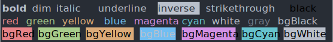

#packages @nkp/ansi

[](https://www.npmjs.com/package/@nkp/ansi)
[](https://github.com/nickkelly1/nkp-ansi/actions/workflows/release.yml)
[](https://snyk.io/test/github/nickkelly1/nkp-ansi)



[ANSI escape codes](https://en.wikipedia.org/wiki/ANSI_escape_code#Colors_and_Styles) for styling strings in the terminal.

You probably want the higher-level [chalk](https://github.com/chalk/chalk) module for styling your strings.

Fork of [`ansi-styles`](https://github.com/chalk/ansi-styles) that supports both ESM and CommonJS.

## Table of contents

- [Exports](#exports)
- [Fork](#fork)
- [Installation](#installation)
  - [npm](#npm)
  - [yarn](#yarn)
  - [pnpm](#pnpm)
- [Publishing](#publishing)

## Exports

`@nkp/ansi` exports both CommonJS and ES modules.

## Fork

`@nkp/ansi` is a fork of [`ansi-styles`](https://github.com/chalk/ansi-styles) that exports both ESM and CommonJS.

In 2021 [Sindre Sorhus](https://gist.github.com/sindresorhus), prolific creator and maintainer of many popular [`npm packages`](https://www.npmjs.com/~sindresorhus), [including some with over 150 million weekly monthly downloads](https://www.npmjs.com/package/chalk), pushed a new major version of many of his packages removing CommonJS support and making them "pure ESM". This was a major breaking change. Sindre's universally popular packages were now incompatible with a large parts of the NodeJS ecosystem.

Sindre's packages could have been kept backwards compatible by producing both ESM and CJS exports, however [Sindre believed he could push the NodeJS community to adopt ESM sooner by introducing breaking changes](https://blog.sindresorhus.com/get-ready-for-esm-aa53530b3f77).

> Personally, I plan to (migrate to Pure ESM *instead* of provide backwards compatibility) as I think it’s better to rip off the bandaid and push the ecosystem forward.

[For many, the breaking change's haven't gone over well](https://gist.github.com/sindresorhus/a39789f98801d908bbc7ff3ecc99d99c). Many project's now find themselves spending hours, days or even weeks trying to placate these pure EMS packages only to find too many incompatibilities and revert back.

Hence this fork. `@nkp/ansi` is intended to be an functionally equivalent clone of `styles-ansi` but with both ESM and CJS exports.

## Installation

### npm

```sh
npm install @nkp/ansi
```

### yarn

```sh
yarn add @nkp/ansi
```

### pnpm

```sh
pnpm add @nkp/ansi
```

## Publishing

To a release a new version:

1. Update the version number in package.json
2. Push the new version to the `master` branch on GitHub
3. Create a `new release` on GitHub for the latest version

This will trigger a GitHub action that tests and publishes the npm package.
